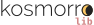

# Kosmorro logos

This repository contains the official logos of [Kosmorro](http://kosmorro.space), in two formats, two variations and two color themes.

Kosmorro's logo is composed of the "Kosmorro" name in lower case, the last "o" being stylized in a representation of a quasi-total solar eclipse.

The font used in the full logo is [Raleway](https://www.theleagueofmoveabletype.com/raleway), created by Matt McInerney and distributed by [the League of Moveable Type](https://www.theleagueofmoveabletype.com) under the terms of the [SIL Open Font License](https://scripts.sil.org/cms/scripts/page.php?site_id=nrsi&id=OFL_web).

<table>
    <tr>
        <td></td>
        <th>Icon</th>
        <th>Kosmorro logo</th>
        <th>Kosmorrolib</th>
        <th>Website URL</th>
    </tr>
    <tr>
        <th>Dark theme</th>
        <td style="background: #ddd">
        <td style="background: #ddd">
        <td style="background: #ddd">
        <td style="background: #ddd">
    </tr>
    <tr>
        <th>Light theme</th>
        <td style="background: #222">
        <td style="background: #222">
        <td style="background: #222">
        <td style="background: #222">
    </tr>
</table>
